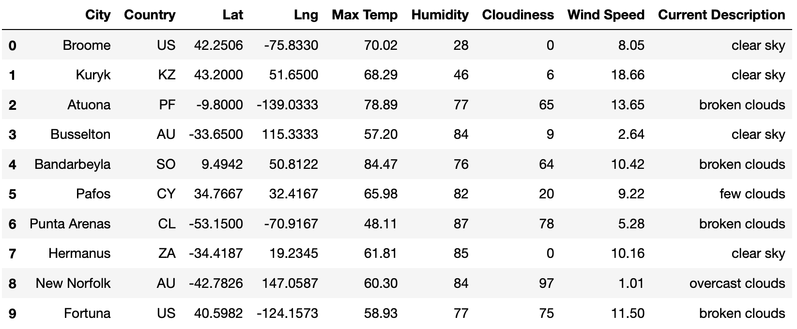
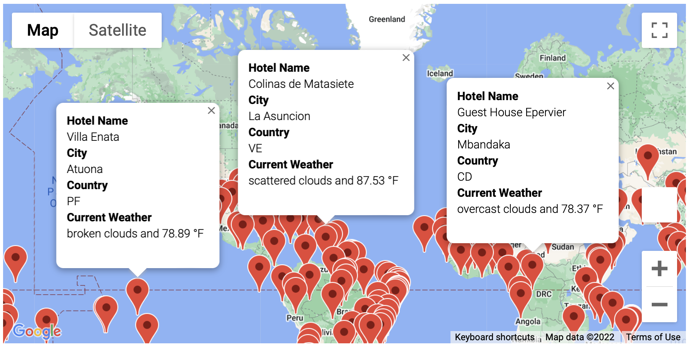
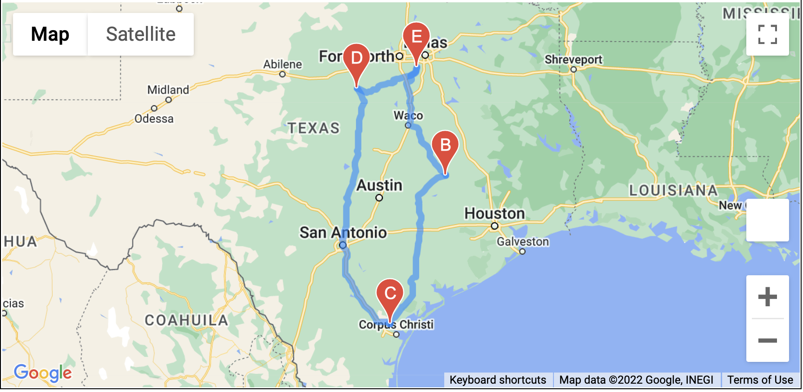

# PlanMyTrip Application Enhancements

## Overview of Analysis

PlanMyTrip is an app used to assist users in planning their vacation. With its recent adoption users were looking for additional enhacements to take this application to the next level.

The initial recommendation is to add the weather description to the weather data to give the users clarity on the weather. From here the users should be able to enter their preferred temperature with which the app will filter to potential travel destinations and hotels nearby them. Finally once the user chooses their preferred travel destination spots, the app should be able to build an itinerary between these destinations.

## Resources
- Data Source: open weather api, google api
- Software: Python 3.9.7, Jupyter Notebook

---

## Application Features and Results

Below are the modules that were built for this enhancement:

1. Weather Database

This module was built to randomly choose destination spots and retrieve different weather details like temperature, humidity, cloudiness, wind speed and weather description. Below is a sample dataset pulled through the process.

2. Vacation Search

Using the vacation search, the users were given the capability to enter their preferred temperature and filter to locations they prefer. This module would then identify hotels nearby these destnations and show a map with markers for users to view. Below is an example image:

3. Vacation Itinerary

In this module the users were given the option to choose 4 destinations and it would build both an itinerary and markers with hotel details in those destinations. Example:

- Itinerary using google directions

- Hotel markers at selected destinations

---

## Application Enhancements Summary

The applications has now been taken to the next level with features enabling users to select destinations to their preference and also build a travel plan along with hotels making it so flexible.